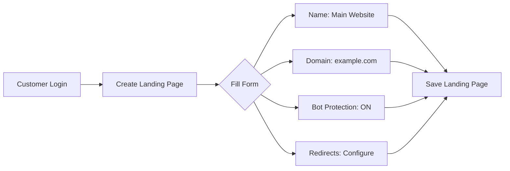
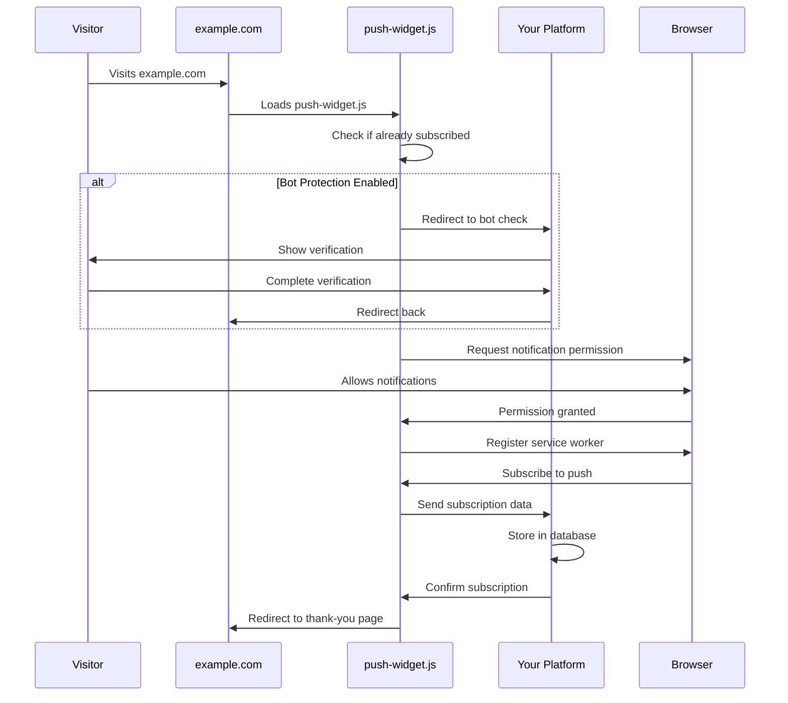
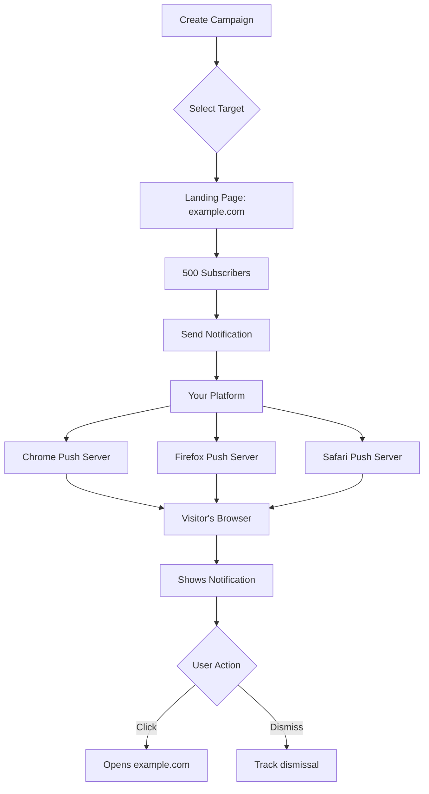

# Push Notification Integration Flow

## Overview

This document explains how customers integrate push notifications on their websites using our platform. The key concept is that notifications appear to come from the customer's domain, not ours.

## Architecture Diagram

```
┌─────────────────────────────────────────────────────────────────────────────┐
│                           YOUR PUSH NOTIFICATION PLATFORM                      │
│                        (push-notification-app-steel.vercel.app)               │
│                                                                               │
│  ┌─────────────────┐  ┌──────────────────┐  ┌───────────────────────────┐  │
│  │  Landing Pages  │  │  Push Clients    │  │  Campaign Management      │  │
│  │  Management     │  │  Database        │  │  & Sending                │  │
│  └─────────────────┘  └──────────────────┘  └───────────────────────────┘  │
│           ▲                    ▲                          │                   │
│           │                    │                          │                   │
└───────────┼────────────────────┼──────────────────────────┼───────────────────┘
            │                    │                          │
            │ 1. Create          │ 3. Store                │ 5. Send
            │    Landing Page    │    Subscription         │    Notifications
            │                    │                          │
┌───────────┼────────────────────┼──────────────────────────┼───────────────────┐
│           ▼                    │                          ▼                   │
│  ┌─────────────────┐          │                 ┌─────────────────┐          │
│  │  Your Customer  │          │                 │  Visitor's      │          │
│  │  (Website Owner)│          │                 │  Browser        │          │
│  └─────────────────┘          │                 └─────────────────┘          │
│           │                    │                          ▲                   │
│           │ 2. Add            │                          │ 4. Show           │
│           │    Integration    │                          │    Notification   │
│           ▼    Code           │                          │                   │
│  ┌─────────────────────────────┼──────────────────────────┘                   │
│  │   CUSTOMER'S WEBSITE        │                                              │
│  │   (example.com)             │                                              │
│  │                             │                                              │
│  │  ┌──────────────────┐  ┌───▼────────────┐  ┌─────────────────────┐      │
│  │  │ Integration Code │  │ Service Worker │  │ Visitor Subscribes  │      │
│  │  │ (push-widget.js) │  │ (push-sw.js)   │  │ to Notifications    │      │
│  │  └──────────────────┘  └────────────────┘  └─────────────────────┘      │
│  │                                                                            │
│  └────────────────────────────────────────────────────────────────────────────┘
└────────────────────────────────────────────────────────────────────────────────┘
```

## Step-by-Step Integration Journey

### 1. Customer Creates Landing Page



**What happens:**
- Customer logs into your platform
- Creates a new landing page entry
- Configures their domain settings
- Receives a unique `landingId`

### 2. Customer Gets Integration Code

```javascript
<!-- Push Notification Integration Code -->
<!-- Domain: example.com | Landing Page: Main Website -->
<script>
(function() {
  // Configuration
  window.PUSH_CONFIG = {
    appUrl: 'https://push-notification-app-steel.vercel.app',
    landingId: 'main-website-2024',
    vapidKey: 'BGv2Vm45eFGslcXFhakD...',
    domain: 'example.com',
    botProtection: true,
    redirects: {
      enabled: true,
      onAllow: 'https://example.com/thank-you',
      onBlock: 'https://example.com/notifications-blocked'
    }
  };
  
  // Load push notification widget
  const script = document.createElement('script');
  script.src = window.PUSH_CONFIG.appUrl + '/js/push-widget.js';
  script.async = true;
  document.head.appendChild(script);
})();
</script>
```

### 3. Integration on Customer's Website

```
Customer's Website (example.com)
├── index.html
│   └── <head>
│       └── [Integration Code Here]
├── push-sw.js (created by our widget)
└── Other website files...
```

### 4. Visitor Subscription Flow



### 5. Data Storage Structure

```
Your Platform Database
└── Landing Pages
    └── example.com (ID: main-website-2024)
        └── Push Clients
            ├── Client 1
            │   ├── Endpoint: https://fcm.googleapis.com/...
            │   ├── Browser: Chrome
            │   ├── OS: Windows
            │   └── Subscribed: 2024-06-13
            ├── Client 2
            │   ├── Endpoint: https://updates.push.services.mozilla.com/...
            │   ├── Browser: Firefox
            │   ├── OS: macOS
            │   └── Subscribed: 2024-06-13
            └── Client 3...
```

### 6. Sending Notifications



## Key Concepts

### Domain Ownership

| Component | Runs On | Owned By | Purpose |
|-----------|---------|----------|---------|
| Your Platform | push-notification-app-steel.vercel.app | You | Manages subscriptions & campaigns |
| Integration Code | example.com | Customer | Loads push widget |
| push-widget.js | Loaded from your domain | You | Handles subscription flow |
| Service Worker | example.com/push-sw.js | Customer | Receives notifications |
| Notifications | Appear from example.com | Customer | User sees customer's domain |

### Security & Isolation

1. **Each landing page is isolated**
   - Unique `landingId`
   - Separate subscriber lists
   - Independent campaigns

2. **Domain verification**
   - Widget checks if domain matches configuration
   - Prevents unauthorized usage

3. **VAPID keys**
   - Your platform's keys for sending
   - But notifications appear from customer's domain

## Common Questions

### Q: Where do notifications come from?
**A:** Notifications appear to come from the customer's domain (example.com), not your platform.

### Q: Who owns the service worker?
**A:** The service worker runs on the customer's domain, making them the "owner" from the browser's perspective.

### Q: Can customers see each other's subscribers?
**A:** No, each landing page (domain) has completely isolated subscriber lists.

### Q: What if a customer has multiple domains?
**A:** They create multiple landing pages, one for each domain, each with its own integration code.

## Benefits of This Architecture

1. **White-label appearance** - Notifications come from customer's brand
2. **Trust** - Users see notifications from the website they subscribed to
3. **Scalability** - One platform serves unlimited customer domains
4. **Analytics** - Centralized tracking across all customers
5. **Easy integration** - Just add one script tag

## Technical Requirements

### For Your Platform:
- HTTPS enabled
- CORS headers configured
- Web Push API implementation
- Database for subscriber management

### For Customer's Website:
- HTTPS enabled (required for push notifications)
- Ability to add JavaScript to HTML
- Service worker support (all modern browsers)

## Integration Testing Checklist

- [ ] Integration code added to customer's website
- [ ] Service worker registers successfully
- [ ] Bot protection works (if enabled)
- [ ] Permission prompt appears
- [ ] Subscription stored in database
- [ ] Test notification sends successfully
- [ ] Notification shows customer's domain
- [ ] Click tracking works
- [ ] Redirects work (if configured)

---

This architecture allows your platform to provide push notification services while maintaining the customer's brand identity and domain ownership.